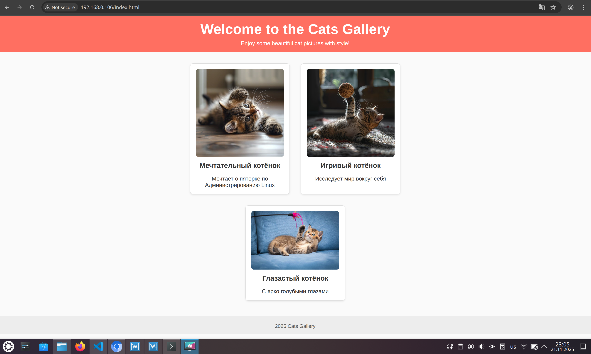
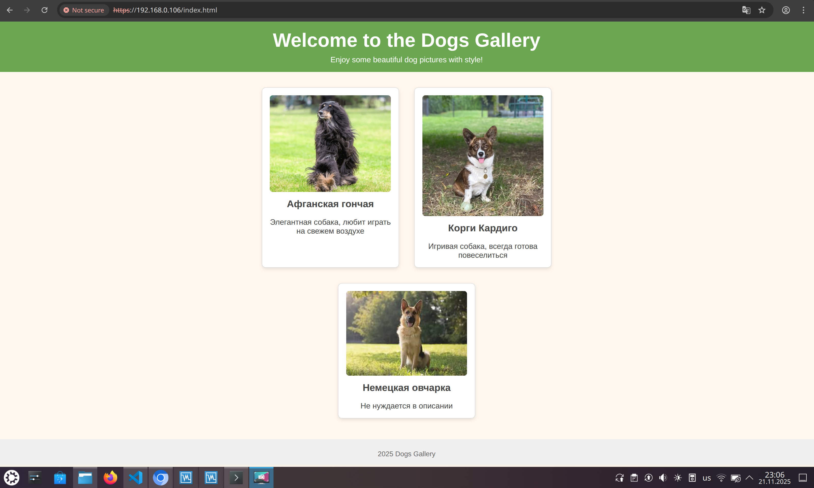

# lab-6

## Что делаем?

[Плейбук](./playbooks/play_full.yml) устанавливает docker, запускает apache веб сервер в контейнере и настраивает sftp демон для удалённого управления контентом веб сервера. 

Согласно заданию, apache конфигурируется для выдачи двух страниц: первой по http, второй по https. Для https генерируется самоподписанный сертификат. 

Логи, файлы конфигурации и контент веб сервера пробрасываются с конфигурируемого хоста в контейнер с помощью bind mount-ов. 

Результат:




## Как использовать?

### Подготовка окружения

1. В VirtualBox поднимаем виртуальную машину с Debian-based дистрибутивом; в моем случае это Ubuntu 22.04.

2. Необходим сетевой доступ между хостом и ВМ + доступ из ВМ в интернет. Проще всего заменить дефолтный NAT адаптер в настройках виртуалки на bridge. 

3. Необходимо настроить безпарольный ssh доступ с хоста до виртуалки.

4. На хосте должен быть установлен ansible.

### Заполнение конфигов

1. Указываем ip и пользователя виртуальной машины в [inventory/main.yml](./inventory/main.yml).

2. Поправляем под себя переменные в [плейбуке](./playbooks/play_full.yml).

### Запуск плейбука

Делаем:

```ansible-playbook ./playbooks/play_full.yml -i ./inventory/main.yml```

### Проверка ftp подключения 